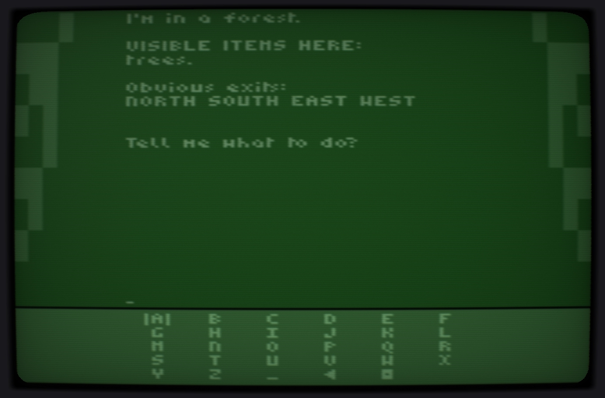

[Adventureland](https://en.wikipedia.org/wiki/Adventureland_(video_game)) is a game created by [Scott Adams](https://en.wikipedia.org/wiki/Scott_Adams_(game_designer)) and released commercially in 1977 for the TRS-80. The game has the distinction of being the first ever game to be released commercially and was the first in a serious of similar games by Adams.

This project a port of `Adventureland` to the `Atari2600`. Specifically, it is a port of the MS-DOS version, written in C (file `advland2.zip` downloadable from the [IF Archive](https://www.ifarchive.org/if-archive/scott-adams/games/))

The `advland.bin` file must be run on either a `Harmony` or `Melody` cartridge or in an emulator capable of emulating the ARM chip found in those cartridge types. [Stella](https://github.com/stella-emu/stella) is a good emulator for this and [Gopher2600](https://github.com/JetSetIlly/Gopher2600) is an alternative.

### Playing the Game

The game must be played with the `Atari2600` keypad plugged into the left player port. If playing with `Stella` you must manually set the controller to keyboard the first time you play the binary. if playing with `Gopher2600` the keyboard will automatically be detected.

Letters are entered in a similar fashion to how you would enter them on a phone keypad. For example, to enter the letter `G` you press the `4` button on the keypad. To enter the letter `O` meanwhile, you would press the `6` button three times.

The following list shows the keys with the corresponding letter groups. Note that letter groups will "cycle". For example, pressing the `2` button four times will select `A` (the letter group having cycled back to the beginning).

| Keypad | Letters |
|:------:|:-------:|
| 1      | special |
| 2      | A B C   |
| 3      | D E F   |
| 4      | G H I   |
| 5      | J K L   |
| 6      | M N O   |
| 7      | Q R S T |
| 8      | U V W   |
| 9      | X Y Z   |
| 0      | space   |
| *      | delete  |
| #      | return  |

The `1` key is special in that it accepts the currently selected letter and moves the cursor along. You only need to use this however if the next letter is in the same group as the current letter.

For example, to enter the word `LOOK` you would enter `L` by pressing the `5` button three times; the first `O` is entered by pressing the `6` button three times. The second `O` however (because it shares the same key) cannot be entered immediately and you must press the `1` button first.

It's tricky to describe but straight forward after some practice.

**The buttons quoted above refer to the buttons on the hardware keypad. If playing through an emulator you must consider which buttons on your computer keyboard correspond to the buttons on the keypad. See `Stella` or `Gopher2600` documenation for details.**

### Technical Details

As far as possible, the original C code has not been changed. Where it has been changed it is only for reasons of accomodating the limitations of the `Atari2600`. Changes made are documented in the `CHANGES.TXT` file in the `arm/advland` directory.

It is likely that some situations will cause the television image to roll briefly. This will depend on the television or emulator settings. The roll is caused by the advland program taking too long for the base 2600 hardware. Without changing more of the C code to accomodate these limitations there is very little that can be done to prevent this.

The `Atari2600` was in no way designed to display text so getting it to display `adventureland` is challenging. For this first version, I have written a very simple text renderer capable of drawing 15 columns of text. Each column can fit two letter `glyphs`, giving a 30 character display. The 15 columns are drawn in groups of five over three frames causing considerable flicker, so a television or emulator setting with high phosphor fade is recommended.

I believe it should be possible to have a 30 character display over two frames (rather than three) but I have not yet tackled that problem.

### Acknowledgements

Scott Adams for the original Adventureland

Morten Lohre for the C port

### Licence

All files with a licencing header are distributed under the BSD 2-Clause licence. All other files are (as far as I know) in the public domain.
